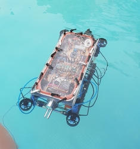

# SRMAUV Software



----

## About

**SRMAUV** is an under-graduate student team of SRM Institute of Science and Technology, founded in the year 2013. We the team of underwater robotics enthusiasts share our common interest in designing of AUVs(Autonomous Underwater Vehicles). The team comprises of members of several domains starting from Computer Science, Electrical and Mechatronics. The team works around the year to publish papers on underwater robotics and prototyping our new vehicle. The team is currently working on its fifth iteration of the vehicle ZARNA 2.0.
The team participates in various national and internal competitions such as Robosub

---
## Achievements 🏆

- National Champions: Secured [first place](https://www.srmist.edu.in/acdemics/srmauv-team-wins-national-championship-save-2015) at NIOT (National Institute for Ocean Technology) SAVe competition held in Chennai in 2015.
- Sponsored by the Indian Government to participate in AUVSI’s international [Robosub](https://robosub.org/) competition at San Diego, USA in 2015 to represent India.
- Received NVIDIA GPU-grant sponsorship for vehicle.
- Team invited to exhibit vehicle at [ACMEE 2018](http://acmee.in/), 13th International Machine Tool Exhibition held at Chennai Trade Centre, Tamil Nadu.
- [Raised](https://www.ketto.org/fundraiser/SRMAUV) over 111,000 INR in funds for building vehicle. 
- Presented novel underwater 3D simulation framework at IEEE OES - [Underwater Technology '19](https://ieeeoes.org/oes-beacon/june-2019-beacon/underwater-technology-2019-ut19-kaohsiung-taiwan-16-19-april-2019/) conference in Kaohsiung, Taiwan.

---
## Vehicle

#### ZARNA


- NVIDIA Jetson TX1
- Sparton AHRS-8 IMU Sensor
- BlackFly S USB-3 Cameras
- Blue Robotics T-200 Thrusters
- ROS Melodic / Ubuntu 18.04

More vehicle specifications [here](./vehicle_specs.html).

---

## Sponsors 🤝

 |  | 
 |  | 
 |  | 

## Blog 📝
> 
- [Underwater Object detection using Deep Learning](./blog/object_detection.html)
- [Custom ROS + Unity 3D Underwater Simulation Framework]()
- [AUV Graphical User Interface]()
- [Smach State Machines]()
- [Actionlib implementation]()
- [PID controller]()

---

## Publication 📃

```
@INPROCEEDINGS{8734309,
    title={Open Source Simulator for Unmanned Underwater Vehicles using ROS and Unity3D},
    author={P. {Katara} and M. {Khanna} and H. {Nagar} and A. {Panaiyappan}},
    booktitle={2019 IEEE Underwater Technology (UT)},
    doi={10.1109/UT.2019.8734309}}
    year={2019},
```
---

## Code 👨🏻‍💻

Code for vehicle's software stack, underwater simulation framework, deep learning object detection ROS packages as well as other ROS-based utility tools has been open-sourced at [github.com/srmauvsoftware](https://www.github.com/srmauvsoftware).

- [ZARNA vehicle software stack](https://github.com/srmauvsoftware/srmauv)
- [Alpheus vehicle software stack](https://github.com/srmauvsoftware/alpheus)
- [Underwater Simulation Framework URSim](https://github.com/srmauvsoftware/URSim)

---

## Gallery 🎞

 |  | 
 | 

## Team 👥


***

## Contact 📧

Reach out to us at `srmauvteam@gmail.com`.

[Email](srmauvteam@gmail.com) | [Linkedin](https://www.linkedin.com/company/team-srmauv) | [Facebook](https://www.facebook.com/SRMAUV) | [Youtube](http://www.youtube.com/c/SRMAUVTeamAutonomousUnderwaterVehicle) | [Twitter](http://twitter.com/SRMAUV)